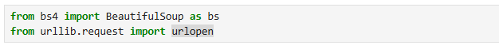
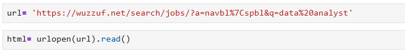
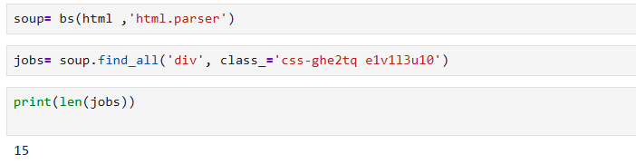
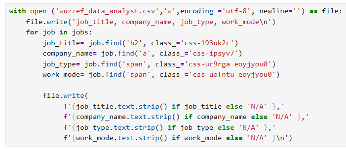

# Wuzzuf Data Analyst Job Scraper

A simple project to scrape **Data Analyst jobs** from **Wuzzuf.net** using Python  
and save the data into a CSV file for analysis.

---

## 📌 Project Idea
This project helps to:
- Learn web scraping
- Collect real job data
- Prepare data for analysis using Pandas

---

## 🛠 Tools Used
- Python  
- BeautifulSoup  
- urllib  
- Pandas  
- Jupyter Notebook  

---

## ⚙️ Workflow
1. import libraries & Send a request to the Wuzzuf job page

   
2. Read the HTML content
 
 
3. Extract job cards

4. Extract:
   - Job Title  
   - Company Name  
   - Job Type  
   - Work Mode
   & Save the data to a CSV file

5. Load the file using Pandas  

---

## 🎯 Skills Used
-Web Scraping
-Data Collection
-Working with CSV files
-Basic Data Analysis preparation

---

## Note
This project is for learning purposes only.

